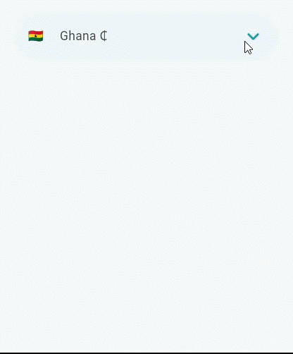

<!--
This README describes the package. If you publish this package to pub.dev,
this README's contents appear on the landing page for your package.

For information about how to write a good package README, see the guide for
[writing package pages](https://dart.dev/tools/pub/writing-package-pages).

For general information about developing packages, see the Dart guide for
[creating packages](https://dart.dev/guides/libraries/create-packages)
and the Flutter guide for
[developing packages and plugins](https://flutter.dev/to/develop-packages).
-->

# UniversalCountryPicker

The universal country picker you've been waiting for!
pick country code, phone, currency etc.
It is designed to be a wrapper so you can make the picker widget anything you want.

## Preview



## Simple Use

1. Import `universal_country_picker.dart`

```dart
import "package:universal_country_picker/universal_country_picker.dart";
```

2. Wrap the target widget with `UniCountryPicker`
```dart
UniCountryPicker(
    builder: (context, Country? selectedCountry, showOverlay){
        return GestureDetector(
            onTap: () => showOverlay(),
            child: YourSelectorWidget()
        )
    },
)
```
## Advanced Usage
This is a highly customizable widget, so feel free to play with the fields.
Here's a preview of all the fields you can use.
```dart
  UniCountryPicker({
    super.key,
    this.showWorldWideOption = false,
    this.labelType = CountryLabelType.nameOnly,
    this.overlayHeight,
    this.initialCountry,
    BoxDecoration? decoration,
    this.overlayWidth,
    required this.builder,
    this.showFlag = true,
    this.overlayAlignment = OverlayAlignment.bottomLeft,
    this.openAnimationDuration = const Duration(milliseconds: 500),
    this.closeAnimationDuration = const Duration(milliseconds: 250),
    this.openAnimationCurve = Curves.easeOutCubic,
    this.closeAnimationCurve = Curves.easeOutCubic,
    this.insetPadding = 10,
    this.overlayPadding = const EdgeInsets.only(left: 10, right: 10, top: 10),
    BoxDecoration? overlayDeco,
    this.searchTextStyle = const TextStyle(fontSize: 15),
    this.hintText = "Search country",
    this.emptyCountryMessage = "No country found",
    this.hintStyle = const TextStyle(color: Colors.grey),
    this.searchHint,
    this.searchBorder,
    this.countryItemStyle,
    this.flagSize = 14,
    this.countryNameStyle,
    this.phoneCodeStyle,
    this.currencySymbolStyle,
    this.countryCodeStyle,
    this.excludeCountries = const [],
    this.onlyTheseCountries = const [],
    required this.context,
    this.overlayOffset = 8,
    this.clearIconButtonStyle = const ButtonStyle(),
    this.clearIconSize = 22,
    this.clearIcon = const Icon(Icons.clear_rounded),
  })
```

#### Don't forget to leave a like 👍